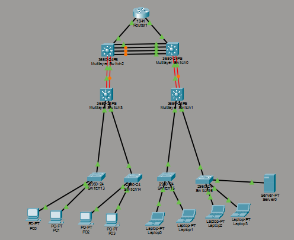

# Simulação de Rede Hierárquica LAN (Cisco Packet Tracer)

Este repositório contém o projeto e a documentação para a **Avaliação 04 - Prática de Simulação de Ambiente Hierárquico**, desenvolvida para a disciplina de **Comutação de Redes Locais** do curso Superior de Tecnologia em Redes de Computadores do **Instituto Federal de Rondônia (IFRO)**[cite: 1].

---

## 📌 Visão Geral do Projeto

O objetivo desta atividade é projetar a topologia física de uma rede local (LAN) utilizando o modelo de três camadas (*Core*, *Distribution* e *Access/Acesso*), garantindo conceitos de **escalabilidade**, **hierarquia**, **redundância** e **disponibilidade**, alinhados aos padrões IEEE 802.3[cite: 1].

A topologia segue estritamente o requisito 5 do roteiro[cite: 2], onde cada switch de núcleo conecta-se **individualmente** ao seu respectivo switch de distribuição por meio de 2 links de fibra óptica (sem conexões cruzadas). Além disso, foram configurados os endereços IP em todos os dispositivos finais para validação do teste de conectividade (item extra)[cite: 2].

---

## 🗺️ Diagrama da Topologia

*Figura 1: Topologia hierárquica final implementada no Cisco Packet Tracer.*

---

## 🏗️ Arquitetura da Rede (Modelo em 3 Camadas)

A arquitetura respeita os requisitos especificados e a divisão hierárquica recomendada:

### 1. Camada de Roteamento / Saída
* **1x Roteador Cisco 1941 (`Router1`)**:
  * Conectado por 2 interfaces FastEthernet, interligando-se individualmente aos dois switches de núcleo (`Multilayer Switch2` e `Multilayer Switch0`)[cite: 2].

### 2. Camada de Núcleo (Core Layer)
* **2x Switches Multicamada (`Multilayer Switch2` e `Multilayer Switch0`)**:
  * **Ligação entre Switches de Núcleo**: Interligados por **4 links físicos de GigabitEthernet (1 Gbps cada)**, estruturados para suportar futura ativação de **Link Aggregation / EtherChannel de 4 Gbps**[cite: 2].
  * **Conexão com a Distribuição**: Conectados **individualmente** a dois switches de distribuição através de pares de **Fibra Óptica** (2 links de 1 Gbps por par), estruturados para futura ativação de **Link Aggregation de 2 Gbps**[cite: 2].

### 3. Camada de Distribuição (Distribution Layer)
* **2x Switches Multicamada (`Multilayer Switch3` e `Multilayer Switch1`)**:
  * `Multilayer Switch3`: Conectado individualmente ao `Multilayer Switch2` via fibra óptica.
  * `Multilayer Switch1`: Conectado individualmente ao `Multilayer Switch0` via fibra óptica.
  * Ambos fazem a ponte entre o núcleo e a camada de acesso/borda.

### 4. Camada de Acesso / Borda (Access Layer)
* **4x Switches de Acesso (`Switch13`, `Switch14`, `Switch15`, `Switch16` - Modelo 2950-24)**:
  * Conectados diretamente aos switches de distribuição de forma simples, sem recursos de redundância[cite: 2].

### 5. Dispositivos Finais (End Devices)
* **4x Desktops (PCs)**: `PC0`, `PC1`, `PC2`, `PC3` (conectados aos switches `Switch13` e `Switch14`)[cite: 2].
* **4x Notebooks (Laptops)**: `Laptop0`, `Laptop1`, `Laptop2`, `Laptop3` (conectados aos switches `Switch15` e `Switch16`)[cite: 2].
* **1x Servidor (`Server0`)**: Conectado diretamente ao `Switch16`[cite: 2].

---

## 🌐 Endereçamento IP e Testes de Conectividade (Atividade Extra - +10%)

Para a realização dos testes de comunicação via comando `ping`, foi configurada a sub-rede **192.168.1.0/24** em todos os hosts finais da rede[cite: 2].

### Tabela de Endereçamento IP

| Dispositivo | Tipo | Interface | Endereço IP | Máscara de Sub-rede | Teste `ping` |
| :--- | :--- | :--- | :--- | :--- | :---: |
| **PC0** | Desktop | FastEthernet0 | `192.168.1.1` | `255.255.255.0` | ✅ Sucesso |
| **PC1** | Desktop | FastEthernet0 | `192.168.1.2` | `255.255.255.0` | ✅ Sucesso |
| **PC2** | Desktop | FastEthernet0 | `192.168.1.3` | `255.255.255.0` | ✅ Sucesso |
| **PC3** | Desktop | FastEthernet0 | `192.168.1.4` | `255.255.255.0` | ✅ Sucesso |
| **Laptop0** | Notebook | FastEthernet0 | `192.168.1.5` | `255.255.255.0` | ✅ Sucesso |
| **Laptop1** | Notebook | FastEthernet0 | `192.168.1.6` | `255.255.255.0` | ✅ Sucesso |
| **Laptop2** | Notebook | FastEthernet0 | `192.168.1.7` | `255.255.255.0` | ✅ Sucesso |
| **Laptop3** | Notebook | FastEthernet0 | `192.168.1.8` | `255.255.255.0` | ✅ Sucesso |
| **Server0** | Servidor | FastEthernet0 | `192.168.1.9` | `255.255.255.0` | ✅ Sucesso |

---

## 📋 Resumo dos Requisitos Atendidos

| Requisito do Roteiro | Status | Descrição |
| :--- | :---: | :--- |
| Estrutura Hierárquica Visível (Núcleo, Distribuição e Borda)[cite: 2] | ✅ | Organizado em 3 níveis claros na área de trabalho. |
| Roteador com 2 interfaces FastEthernet ligado a 2 switches[cite: 2] | ✅ | `Router1` conectado com 2 links FastEthernet. |
| Ligação física para Link Aggregation de 4Gbps no Núcleo[cite: 2] | ✅ | 4 cabos de 1Gbps interligando os switches de núcleo. |
| Ligação por Fibra Óptica (Link Aggregation 2Gbps) Core-Distribuição[cite: 2] | ✅ | Conexão individual via 2 links de fibra por switch de distribuição. |
| 4 Switches de Borda sem redundância[cite: 2] | ✅ | Switches 2950-24 interligando os clientes finais. |
| Dispositivos finais (4 PCs, 4 Laptops, 1 Servidor)[cite: 2] | ✅ | 9 dispositivos finais conectados com cabo metálico. |
| **Extra**: Endereçamento IP e Teste via `ping` (+10%)[cite: 2] | ✅ | Todos os hosts configurados e se comunicando com sucesso. |

---

## 📂 Arquivos no Repositório

* `README.md`: Documentação detalhada do projeto.
* `topologia_hierarquica.pkt`: Arquivo do Cisco Packet Tracer.
* `image_ee2249.png`: Imagem da topologia exibida nesta documentação.

---

## 👤 Autor

* **Aluno**: [Seu Nome Aqui]
* **Curso**: CST em Redes de Computadores
* **Instituição**: Instituto Federal de Rondônia (IFRO)[cite: 1]
* **Disciplina**: Comutação de Redes Locais[cite: 1]
